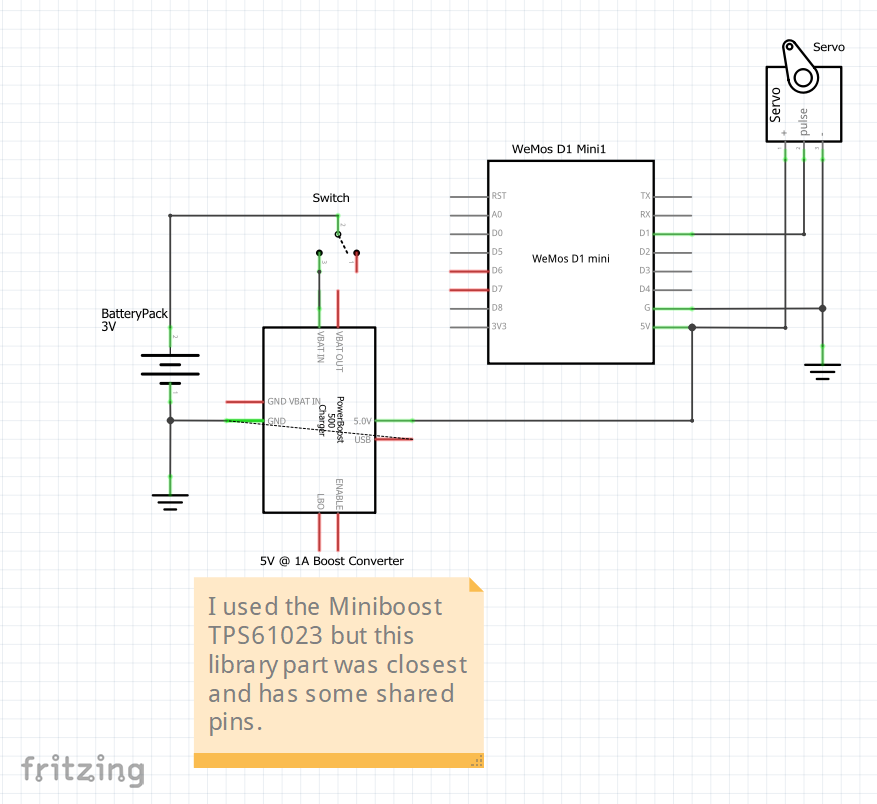

# Reception Center Piece
This was the planetary gear center piece that I designed & implemented for my reception. 

This repo is a way to share design files and provide an assembly tutorial for those who want to use this for their own reception, fork off the design, or just print their own copy of this cool decoration piece. 

## Clone this repository
Open a terminal wherever you want to place this folder. Then clone this repository and the webrepl submodule with:
```bash
git clone https://github.com/pwolfe8/receptionCenterPiece
cd receptionCenterPiece
git submodule update --init --recursive
```
___
## Mechanical
I printed this on a Prusa i3 MK3S. The trays and all the settings are in the `print_trays` folder.
I printed with [standard 1.75mm black PETG filament](<https://www.amazon.com/dp/B08XGX23TP?psc=1&ref=ppx_yo2_dt_b_product_details>) on a textured prusa print tray. 

Approximate total print time: ~19 hrs depending on heating/cooling time.

Design files can be found on Onshape: 
- [fullDesignReception](<https://cad.onshape.com/documents/7be5b9b09e066ba446a30efc/w/afbadb4d389ea6207fcba0bc/e/a346c253faa0d5286ebe5b9c?renderMode=0&uiState=616b083ecb150f63125368d4>)
- [AA_3V_Boost5V](<https://cad.onshape.com/documents/a1963687730519ec8fcaa736/w/4932db5a468bc2b8e7c12e8f/e/31f6f86f6f40c3d5acde4a41?renderMode=0&uiState=616b1a22ca3c791168b4c31e>)

screw bolts/nuts used:
- 2x M2x8 screws ([here's](<https://www.amazon.com/gp/product/B07F739QCM/ref=ppx_yo_dt_b_search_asin_title?ie=UTF8&th=1>) the metric screw bolt/washer/nut kit I used. good to have around for various projects)
- 2x M2 nuts from same kit
- the small philips head screw that came with the microservo

## Painting & Decoration
I did not do the painting/decoration my wife and her sister did. My wife also came up with the concept. 

The premise for painting was paint a thin copper layer leaving some black showing underneath to look like worn copper for more of a steampunk feel. 
DO NOT print the smooth interface between the ring gear and the sun/planetary gears as it will add too much friction to move easily. 

Here's a quick DO NOT paint list: 
- bottom of planetary gears
- bottom of sun gear
- part of ring gear touching the bottom of the planetary/sun gears
- the base drive gear & anything used to hold it in place as it's hidden underneath anyways
- the servo horn attachment (it's hidden as well)

Decoration involved several amazon and hobby lobby items and is really up to you. [insert picture here later of ours decorated]

## Electrical

Wanted to try out micropython so I got these [D1 Mini modules](<https://www.amazon.com/dp/B08QZ2887K?psc=1&ref=ppx_yo2_dt_b_product_details>) based on the ESP8266 and flashed them with the latest version. They averaged 3 dollars each at the time I purchased them. 

If you just care about You can use any microcontroller and make your own electronics box for it as long as
- powerable off 5V since that's what the boost converter output is. (and servo needs 5V pwr). though you could power off 3V directly from battery if you modify the circuit
- has a pwm pin to drive servo

Anyways here's the parts list to make a single center piece: 
- 1x [microcontroller](<https://www.amazon.com/dp/B08QZ2887K?psc=1&ref=ppx_yo2_dt_b_product_details>) (D1 mini)
- 1x [micro servo](<https://www.amazon.com/dp/B07L2SF3R4?psc=1&ref=ppx_yo2_dt_b_product_details>) (modified for continuous rotation. you can just buy one that's continuous to make your life easier. only slightly pricier though. In the improved version I will make it based off of a continuous one.)
- 1x [5V 1A boost converter](<https://www.adafruit.com/product/4654>)(adafruit/digikey): This might've been more current than needed, but was better to be safe for a rapid prototype)
- 1x [mechanical switch](<https://www.adafruit.com/product/3221>)(adafruit): just a cool clickly mechanical switch
- 2x [battery contact positive](<https://www.digikey.com/en/products/detail/mpd-memory-protection-devices/SN-T5-2/2439587>)(digikey)
- 2x [battery contact negative](<https://www.digikey.com/en/products/detail/mpd-memory-protection-devices/SN-T5-1/2439583>)(digikey)
- the screw bolts/nuts listed in the mechanical section

and here's the schematic (full fritzing file in the circuit folder): 


### Servo Modification for Continuous Rotation

I was a dumbass and bought normal servos with limited range. For a little more money you can buy continuous servos in the same shape. I will post a link once I try some to make sure they have the same dimensions...

But if you really don't want to wait, here's a guide on what I did to modify the servo and the servo horn:
Maybe wear gloves to avoid silicon grease on you.
- unscrew the 4 screws
- place the gears out in the order you took them off so you don't forget
- remove the metal blocking component off the potentiometer
- replace the gears in order except the last top one
- clip the plastic blocking part off with flush cutters and smooth with exacto knife
- replace top gear and screw back together
- then take the cross shaped servo horn and chip away until you snip off the long sides with flush cutters. then make a smooth curve with flush cutters.
- use the small philips screw to hold the horn in

## Firmware/Software
[This Guide](software/D1_tutorial.md) will show you how to install the tools to flash and setup your D1 Mini for over the air updates.

I also included the version of micropython I used for this board already downloaded in the software folder [here](software/esp8266-20210902-v1.17.bin). Follow the guide to flash it on your board and send over the main.py for this center piece heartbeat pulse code.

___
## Assembly
Once you have all the pieces printed, follow this guide on assembly.
Note: pull up the onshape as a visual reference for the fully assembled piece. feel free to hide/show parts to see internals if it's unclear.

### Mechanical Assembly

Clean up the brims off all the pieces, especially the gears that will be interfacing with other gears. If you experience jamming it's probably because you haven't fully cleaned the brim off every tooth of one of the gears.

First assemble the base & motor box:
- get the base support piece and the motor box and pegs.
- align the motor box appropriately to base following the onshape design.
- now make sure the motor box and base have a shared flat surface on the bottom. feel free to put on a table to see if it's level
- then push/wiggle the pegs into place (friction fit) to hold the motor box to the base. you may have to sand/trim the hole/pegs
- Now attach the servo motor with M2 screws/nuts. I used M2x8 but you can take up to M2x12 as well. screw head coming from underneath motor box and nut on top of motor.  
NOTE: there are 2 orientations, make sure the way you choose gets the servo horn aligned with the center of the box. Not the other way
- now undo the small philips head on the servo, put the gear attachment over the servo horn, and then screw the small philips back in.

Now assemble the drive gear:
- stack the drive gear + ring gear + sun gear as shown in the cad design files.
- put the drive shaft through such that the top circle stopper is stopped against the sun gear.
- put the locking ring and shaft through to make sure it's held in place. 
- pull the ring gear away from the drive gear so they no longer contact other than by the drive shaft (should be ~2mm gap)

Place the drive gear assembly on the base by aligning the 2 small notches on the outside of the ring gear with the base. If it doesn't fit you've put your motor on in the wrong orientation so reverse/repeat steps to flip it.  Congrats! hard part done


Now assemble the platforms/planetry gear pieces.

Let's assemble the first/shortest platform first.
- find the 3 candle holders, first platform, shortest shaft, and 1 planetary gear
- get the shortest candle holder and place it in first then go clockwise like in the onshape and put the next highest, then tallest in. refer to onshape if you get stuck.
- now put the shortest shaft into the bottom shaft hole.
- then place the planetary gear onto the other side of the shaft

Next 2 platforms are straight forward: 
- get 2nd platform (feel free to hot glue some decorations on first, just make sure it's close enough balanced weight-wise for stability)
- get the middle length shaft and a planetary gear
- insert shaft into 2nd platform shaft hole and planetary gear shaft hole
- repeat for 3rd platform

Now final assembly before electrical box:
- place the 1st platform assembly inbetween sun & ring gear
- place the 2nd platform assembly 120 degrees off in the same manner
- place the 3rd platform assembly 120 degrees off in the same manner

Electrical box:
- make sure the orientation matches the onshape 
- place the switch holder into the groove
- place the battery box in the large rectangle with the boost converter facing out


### Electrical Assembly/Wiring Harness
Sadly I didn't have time to make a pcb with nice connectors and all, so I twisted together some wires and hand soldered the wiring harness.  In the future I'll release a pcb design but for now here's what I did:

tools:
- some 22 gauge solid core wire
- strippers/wire cutters
- soldering iron
- heatshrink/heat gun or lighter 


I got a 22 gauge solid core wire pack with different colors off amazon

Cut the following lengths per color and strip each side:
- white: 4, 6 cm
- red: 4, 4, 6 cm  (strip one side more for twist)
- black: 5, 5, 6, 7 cm (strip one side more for twist)
- blue: 2 cm (strip to 1.5 cm insulation)
- yellow: 4 cm 

now assemble: 
- twist the longer red exposed ends together and solder
- repeat for black
- solder blue wire as battery pack series connection
- solder white wire from pack to switch using 6 cm
- solder black long wire to pack ground
- complete rest of soldering according to the circuit schematic above

afterwards you can use a label maker to label on/off depending on how you wired it to the switch
